# Keystone Federation

- Service Provider: RHOSP13(Queen) Packstack All in One
  - Apache module: Shibboleth (mod_shib)

- Identity Provider: TestShib

# 動き

## Horizon

HorizonのURLをブラウザで開くと、認証方式を選択する画面が出ます。

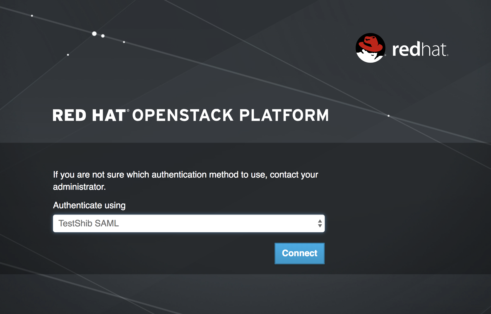

SAML連携によりIdPで認証するか("TestShib SAML")、SP上で稼働するKeystoneでローカル認証するか("Keystone Credentials")を選択できます。
Keystone Credentialsを選択した場合は、従来の認証と同じです。

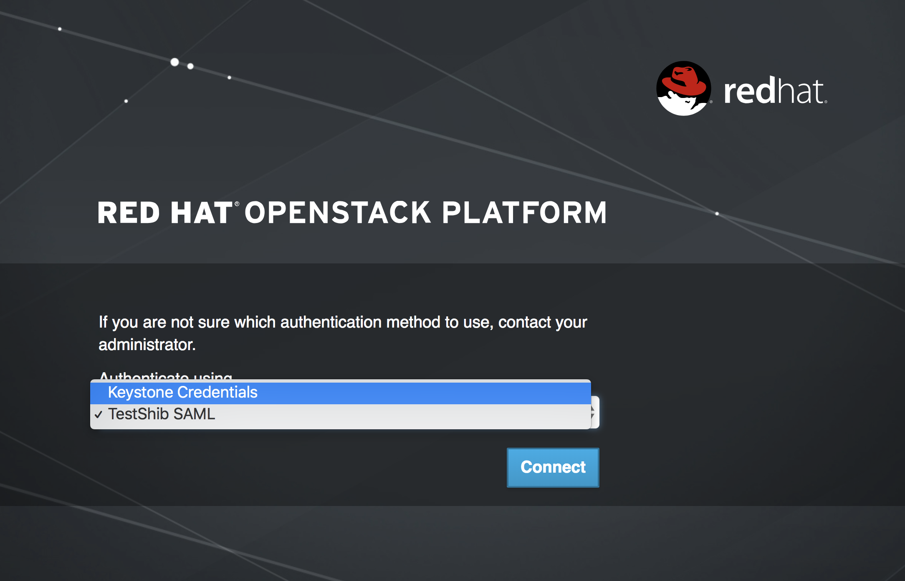

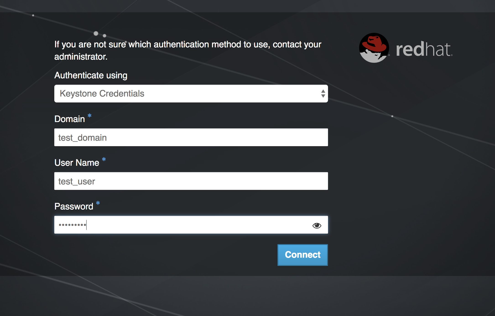

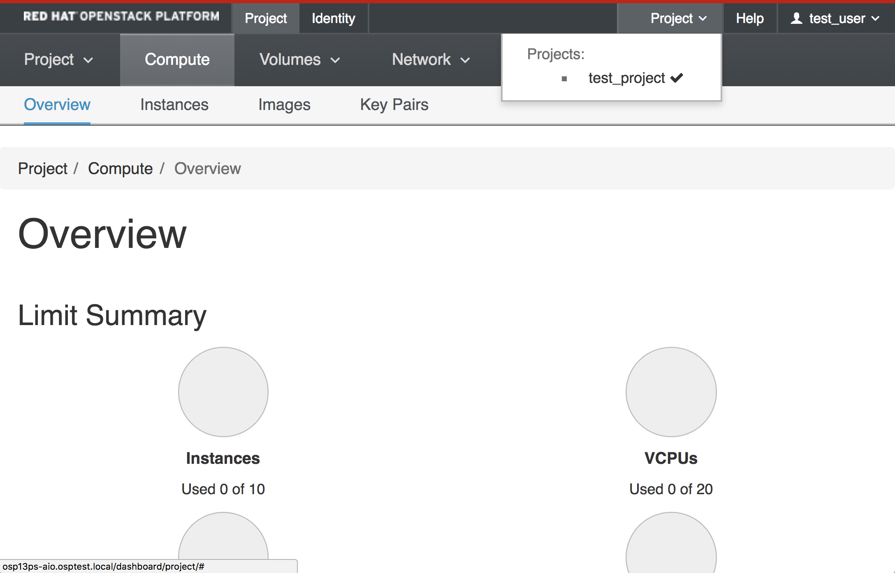

TestShib SAMLを選択すると、TestShibのIdP認証サイトにリダイレクトされます。

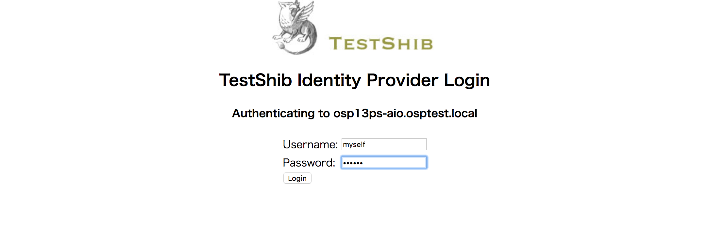

認証情報を入れてloginボタンを押すと、IdP側でユーザー名とパスワードの確認を行い、認証が通れば再びリダイレクトされて、Horizonの画面に戻ってきます。

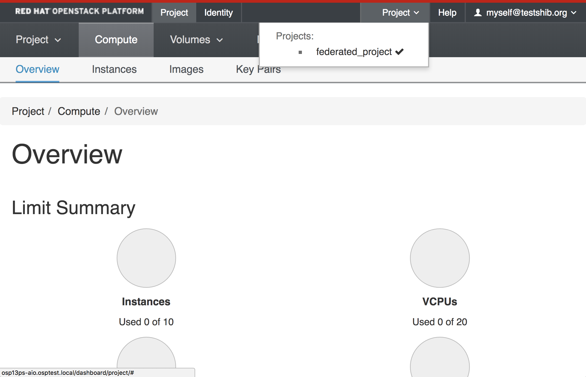

プロジェクトとユーザーの情報を確認します。ドメイン名が空であることに注意します。

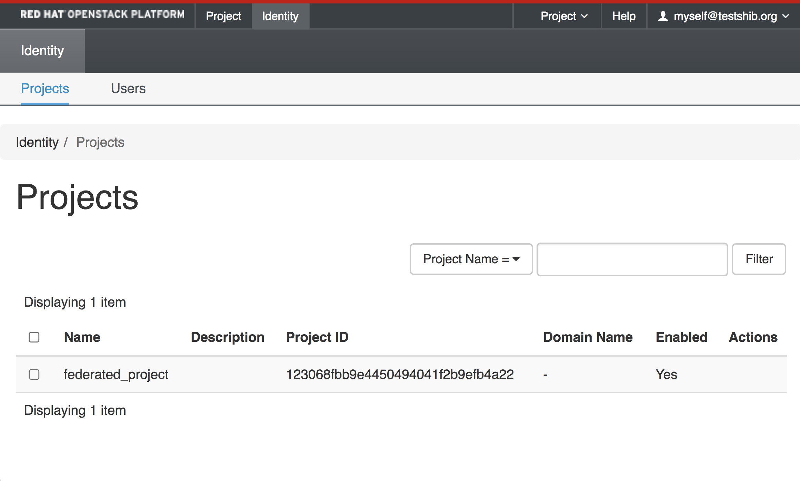

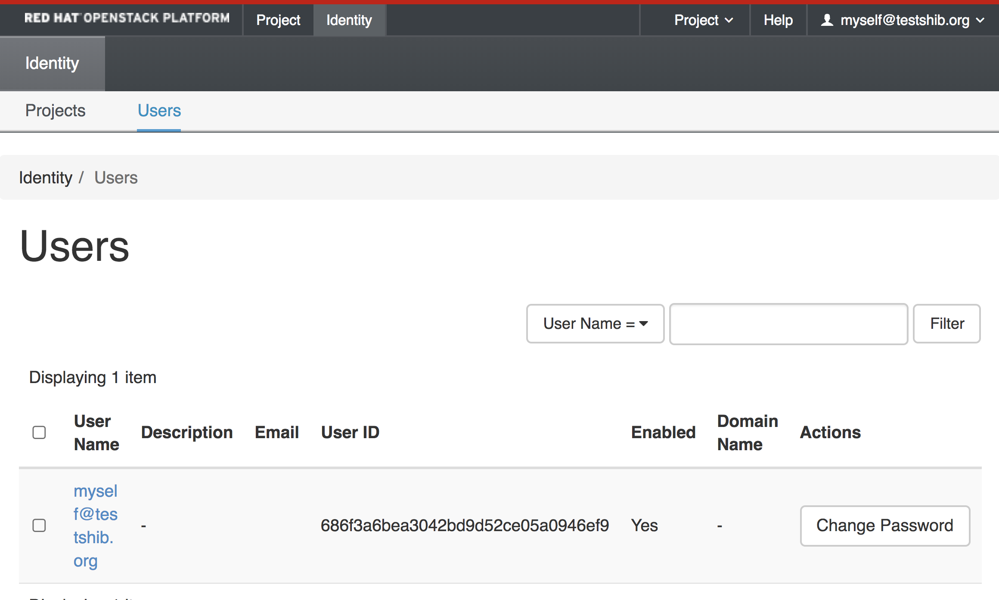

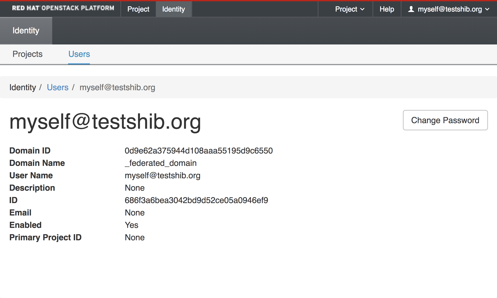

ユーザーの詳細を見ると、ドメイン名に "_federated_domain" というドメイン名になっています。

CLIの動作確認用に、ボリュームを1個作っておきます。

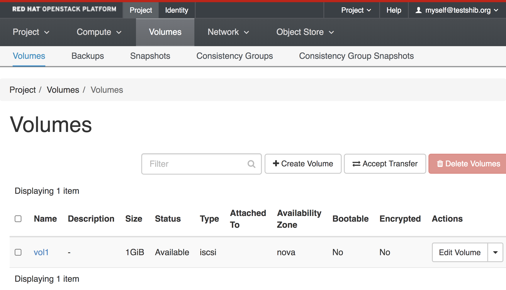

念の為IDも確認しておきます (bef5125f-6ea9-4765-9f5e-390b17d712b0でした)。

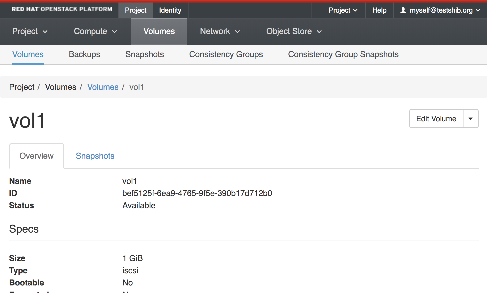

## CLI

adminユーザーでドメイン一覧を取得します。

```
[root@osp13ps-aio ~]# source keystonerc_admin
[root@osp13ps-aio ~(keystone_admin)]# openstack domain list
+----------------------------------+----------------------------------+---------+-----------------------------------------------------------------+
| ID                               | Name                             | Enabled | Description                                                     |
+----------------------------------+----------------------------------+---------+-----------------------------------------------------------------+
| 0d9e62a375944d108aaa55195d9c6550 | 0d9e62a375944d108aaa55195d9c6550 | True    | Auto generated federated domain for Identity Provider: testshib |
| 28ed9755c6e94a41a30b650ad258cd74 | federated_domain                 | True    |                                                                 |
| 8700f81bf7514333a3b839c895621b7f | test_domain                      | True    |                                                                 |
| default                          | Default                          | True    | The default domain                                              |
+----------------------------------+----------------------------------+---------+-----------------------------------------------------------------+
```

SAMLログインすると、ローカル環境では、自動的に作成されたドメイン(id: 0d9e62a375944d108aaa55195d9c6550)でログインしているように見えます。
Horizon上のユーザー詳細画面で表示された謎の名前は、[federation]federated_domain_nameで設定した値です。
自動生成されたドメインの場合、ここで設定したドメイン名が表示されていたのでした。

```
[root@osp13ps-aio ~(keystone_admin)]# crudini --get /etc/keystone/keystone.conf federation federated_domain_name
_federated_domain
```

その他の情報を出しておきます。

- プロジェクト一覧

```
[root@osp13ps-aio ~(keystone_admin)]# openstack project list
+----------------------------------+-------------------+
| ID                               | Name              |
+----------------------------------+-------------------+
| 123068fbb9e4450494041f2b9efb4a22 | federated_project |
| 412076e74c0c4a049be639b86f39f21a | services          |
| 91a50475dc184b13bbaff80ce5be7fd3 | admin             |
| 937d6193395443be9426c88c56a15768 | test_project      |
| c8a52c6474724e70b7fffb8292fc384b | demo              |
| d2a071e24cd44db29a4cee115f64a5e2 | test_domain       |
+----------------------------------+-------------------+
```

- ユーザー一覧

```
[root@osp13ps-aio ~(keystone_admin)]# openstack user list
+----------------------------------+---------------------+
| ID                               | Name                |
+----------------------------------+---------------------+
| 01ec395e858a4dd3be2a4cc235ef9b39 | test_user           |
| 264bccaaabe94c279f8e893b9e4b1a0c | demo                |
| 387e9d1ed0b047fcbb9863e69107fb5f | aodh                |
| 442f62b224d149129c1d120c01ba2a64 | ceilometer          |
| 552d754bb35a4dbe98836adc61ae16e7 | nova                |
| 654d9b299c4c4cec96fd7216b6c9a40c | admin               |
| 686f3a6bea3042bd9d52ce05a0946ef9 | myself@testshib.org |
| 92ff1d0ed0944e3fb8544d054ca0e295 | placement           |
| 9b0b651e7d44417592a000bef630cba5 | gnocchi             |
| a314cb3bf97b458087c476ee75c0706d | cinder              |
| b56c852bc4f94398959ff44d6273f40f | neutron             |
| c7bfef0a104f41cfb6437f853d99468b | swift               |
| f8b430c963104a5a9867bcd1861e1930 | glance              |
+----------------------------------+---------------------+
```

- グループ一覧

```
[root@osp13ps-aio ~(keystone_admin)]# openstack group list
+----------------------------------+-----------------+
| ID                               | Name            |
+----------------------------------+-----------------+
| 72fb4dcf9f0c4181a1ba90d145484558 | federated_users |
+----------------------------------+-----------------+
```

- ロール一覧

```
[root@osp13ps-aio ~(keystone_admin)]# openstack role list
+----------------------------------+---------------+
| ID                               | Name          |
+----------------------------------+---------------+
| 336b325cee8649d09e1ab07a45623fde | admin         |
| 9fe2ff9ee4384b1894a90878d3e92bab | _member_      |
| c8699aa24d4b4cce8b11a02b88cf78f4 | ResellerAdmin |
| f993b78bb2bb4a8cafcc2f26463203a1 | SwiftOperator |
+----------------------------------+---------------+
```

- ロールのアサイン

```
[root@osp13ps-aio ~(keystone_admin)]# openstack role assignment list
+----------------------------------+----------------------------------+----------------------------------+----------------------------------+----------------------------------+-----------+
| Role                             | User                             | Group                            | Project                          | Domain                           | Inherited |
+----------------------------------+----------------------------------+----------------------------------+----------------------------------+----------------------------------+-----------+
| 9fe2ff9ee4384b1894a90878d3e92bab | 01ec395e858a4dd3be2a4cc235ef9b39 |                                  | 937d6193395443be9426c88c56a15768 |                                  | False     |
| 9fe2ff9ee4384b1894a90878d3e92bab | 264bccaaabe94c279f8e893b9e4b1a0c |                                  | c8a52c6474724e70b7fffb8292fc384b |                                  | False     |
| 336b325cee8649d09e1ab07a45623fde | 387e9d1ed0b047fcbb9863e69107fb5f |                                  | 412076e74c0c4a049be639b86f39f21a |                                  | False     |
| 336b325cee8649d09e1ab07a45623fde | 442f62b224d149129c1d120c01ba2a64 |                                  | 412076e74c0c4a049be639b86f39f21a |                                  | False     |
| c8699aa24d4b4cce8b11a02b88cf78f4 | 442f62b224d149129c1d120c01ba2a64 |                                  | 412076e74c0c4a049be639b86f39f21a |                                  | False     |
| 336b325cee8649d09e1ab07a45623fde | 552d754bb35a4dbe98836adc61ae16e7 |                                  | 412076e74c0c4a049be639b86f39f21a |                                  | False     |
| 336b325cee8649d09e1ab07a45623fde | 654d9b299c4c4cec96fd7216b6c9a40c |                                  | 91a50475dc184b13bbaff80ce5be7fd3 |                                  | False     |
| 336b325cee8649d09e1ab07a45623fde | 92ff1d0ed0944e3fb8544d054ca0e295 |                                  | 412076e74c0c4a049be639b86f39f21a |                                  | False     |
| 336b325cee8649d09e1ab07a45623fde | 9b0b651e7d44417592a000bef630cba5 |                                  | 412076e74c0c4a049be639b86f39f21a |                                  | False     |
| 336b325cee8649d09e1ab07a45623fde | a314cb3bf97b458087c476ee75c0706d |                                  | 412076e74c0c4a049be639b86f39f21a |                                  | False     |
| 336b325cee8649d09e1ab07a45623fde | b56c852bc4f94398959ff44d6273f40f |                                  | 412076e74c0c4a049be639b86f39f21a |                                  | False     |
| 336b325cee8649d09e1ab07a45623fde | c7bfef0a104f41cfb6437f853d99468b |                                  | 412076e74c0c4a049be639b86f39f21a |                                  | False     |
| 336b325cee8649d09e1ab07a45623fde | f8b430c963104a5a9867bcd1861e1930 |                                  | 412076e74c0c4a049be639b86f39f21a |                                  | False     |
| 9fe2ff9ee4384b1894a90878d3e92bab |                                  | 72fb4dcf9f0c4181a1ba90d145484558 | 123068fbb9e4450494041f2b9efb4a22 |                                  | False     |
| 9fe2ff9ee4384b1894a90878d3e92bab |                                  | 72fb4dcf9f0c4181a1ba90d145484558 |                                  | 28ed9755c6e94a41a30b650ad258cd74 | False     |
| 336b325cee8649d09e1ab07a45623fde | 654d9b299c4c4cec96fd7216b6c9a40c |                                  |                                  |                                  | False     |
+----------------------------------+----------------------------------+----------------------------------+----------------------------------+----------------------------------+-----------+
```

CLIで、作成したボリュームの一覧が取得できることを確認します。

まず、プロジェクトを指定しない unscoped token を取得します。

```
[root@osp13ps-aio ~(keystone_admin)]# openstack \
> --os-identity-api-version 3 \
> --os-auth-type v3samlpassword \
> --os-auth-url http://osp13ps-aio.osptest.local:5000/v3 \
> --os-identity-provider testshib \
> --os-identity-provider-url https://idp.testshib.org/idp/profile/SAML2/SOAP/ECP \
> --os-protocol saml2 \
> --os-username myself \
> --os-password myself \
> --os-user-domain-name '' \
> --os-project-domain-name '' \
> --os-project-name '' \
> token issue
+---------+--------------------------------------------------------------------------------------------------------------------------------------------------------------------------------------------------------------+
| Field   | Value                                                                                                                                                                                                        |
+---------+--------------------------------------------------------------------------------------------------------------------------------------------------------------------------------------------------------------+
| expires | 2018-09-12T03:06:30+0000                                                                                                                                                                                     |
| id      | gAAAAABbmHSmXNfSV2jRIua5gF3P4bKg4q044LKNx0SWf6ADHy9AXEHOtNjuOOzc4k6ZnY74j7mDL3v8KLUAihpq-2365yt6XklluqDNuAyvxcIsL_D8_Y4tQKhWU4Eck-HXb60-DRFPbBonxOQERSjtC9bdyN77GrfzgEyNdHz8iAsFOweGHcuHHjr3a3kDbynfAfFCBRLX |
| user_id | 686f3a6bea3042bd9d52ce05a0946ef9                                                                                                                                                                             |
+---------+--------------------------------------------------------------------------------------------------------------------------------------------------------------------------------------------------------------+
```

このトークンを使用して、Federationしているドメインやプロジェクトの情報を取得します。

- federation domain一覧

```
[root@osp13ps-aio ~(keystone_admin)]# openstack \
> --os-identity-api-version 3 \
> --os-auth-type token \
> --os-auth-url http://osp13ps-aio.osptest.local:5000/v3 \
> --os-identity-provider testshib \
> --os-identity-provider-url https://idp.testshib.org/idp/profile/SAML2/SOAP/ECP \
> --os-protocol saml2 \
> --os-token gAAAAABbmHSmXNfSV2jRIua5gF3P4bKg4q044LKNx0SWf6ADHy9AXEHOtNjuOOzc4k6ZnY74j7mDL3v8KLUAihpq-2365yt6XklluqDNuAyvxcIsL_D8_Y4tQKhWU4Eck-HXb60-DRFPbBonxOQERSjtC9bdyN77GrfzgEyNdHz8iAsFOweGHcuHHjr3a3kDbynfAfFCBRLX \
> --os-user-domain-name '' \
> --os-project-domain-name '' \
> --os-project-name '' \
> federation domain list
+----------------------------------+---------+------------------+-------------+
| ID                               | Enabled | Name             | Description |
+----------------------------------+---------+------------------+-------------+
| 28ed9755c6e94a41a30b650ad258cd74 | True    | federated_domain |             |
+----------------------------------+---------+------------------+-------------+
```

- federation project一覧

```
[root@osp13ps-aio ~(keystone_admin)]# openstack \
> --os-identity-api-version 3 \
> --os-auth-type token \
> --os-auth-url http://osp13ps-aio.osptest.local:5000/v3 \
> --os-identity-provider testshib \
> --os-identity-provider-url https://idp.testshib.org/idp/profile/SAML2/SOAP/ECP \
> --os-protocol saml2 \
> --os-token gAAAAABbmHSmXNfSV2jRIua5gF3P4bKg4q044LKNx0SWf6ADHy9AXEHOtNjuOOzc4k6ZnY74j7mDL3v8KLUAihpq-2365yt6XklluqDNuAyvxcIsL_D8_Y4tQKhWU4Eck-HXb60-DRFPbBonxOQERSjtC9bdyN77GrfzgEyNdHz8iAsFOweGHcuHHjr3a3kDbynfAfFCBRLX \
> --os-user-domain-name '' \
> --os-project-domain-name '' \
> --os-project-name '' \
> federation project list
+----------------------------------+----------------------------------+---------+-------------------+
| ID                               | Domain ID                        | Enabled | Name              |
+----------------------------------+----------------------------------+---------+-------------------+
| 123068fbb9e4450494041f2b9efb4a22 | 28ed9755c6e94a41a30b650ad258cd74 | True    | federated_project |
+----------------------------------+----------------------------------+---------+-------------------+
```

Federationしているドメインとプロジェクトがわかったので、これらを指定して scoped token を取得します。

```
[root@osp13ps-aio ~(keystone_admin)]# openstack \
> --os-identity-api-version 3 \
> --os-auth-type token \
> --os-auth-url http://osp13ps-aio.osptest.local:5000/v3 \
> --os-identity-provider testshib \
> --os-identity-provider-url https://idp.testshib.org/idp/profile/SAML2/SOAP/ECP \
> --os-protocol saml2 \
> --os-token gAAAAABbmHSmXNfSV2jRIua5gF3P4bKg4q044LKNx0SWf6ADHy9AXEHOtNjuOOzc4k6ZnY74j7mDL3v8KLUAihpq-2365yt6XklluqDNuAyvxcIsL_D8_Y4tQKhWU4Eck-HXb60-DRFPbBonxOQERSjtC9bdyN77GrfzgEyNdHz8iAsFOweGHcuHHjr3a3kDbynfAfFCBRLX \
> --os-user-domain-name '' \
> --os-project-domain-name federated_domain \
> --os-project-name federated_project \
> token issue
+------------+------------------------------------------------------------------------------------------------------------------------------------------------------------------------------------------------------------------------------------+
| Field      | Value                                                                                                                                                                                                                              |
+------------+------------------------------------------------------------------------------------------------------------------------------------------------------------------------------------------------------------------------------------+
| expires    | 2018-09-12T03:13:16+0000                                                                                                                                                                                                           |
| id         | gAAAAABbmHY8CA8xIqiPBtMkNJReclxmM7QJ7Wkbgy7Y4entn6HTQpwafVO1X0GgAD7hwkZdblS-9atTbr_9X5wFlgVHXmFlRI_bcyif1tQWhnMxxtmHF9Diq3CTO0jVPhOb06n7JxDH7SJjKETdR8Ju4dja0bz_CLIXHtKd6P4S5nCf_Zn947zySe6skHfoFdQyemMzKNeHlys0PE1B-SUUl3dTE5dNOw |
| project_id | 123068fbb9e4450494041f2b9efb4a22                                                                                                                                                                                                   |
| user_id    | 686f3a6bea3042bd9d52ce05a0946ef9                                                                                                                                                                                                   |
+------------+------------------------------------------------------------------------------------------------------------------------------------------------------------------------------------------------------------------------------------+
```

このscoped tokenを使って、ボリューム一覧を取得します。

```
[root@osp13ps-aio ~(keystone_admin)]# openstack \
> --os-identity-api-version 3 \
> --os-auth-type token \
> --os-auth-url http://osp13ps-aio.osptest.local:5000/v3 \
> --os-identity-provider testshib \
> --os-identity-provider-url https://idp.testshib.org/idp/profile/SAML2/SOAP/ECP \
> --os-protocol saml2 \
> --os-token gAAAAABbmHY8CA8xIqiPBtMkNJReclxmM7QJ7Wkbgy7Y4entn6HTQpwafVO1X0GgAD7hwkZdblS-9atTbr_9X5wFlgVHXmFlRI_bcyif1tQWhnMxxtmHF9Diq3CTO0jVPhOb06n7JxDH7SJjKETdR8Ju4dja0bz_CLIXHtKd6P4S5nCf_Zn947zySe6skHfoFdQyemMzKNeHlys0PE1B-SUUl3dTE5dNOw \
> --os-user-domain-name '' \
> --os-project-domain-name federated_domain \
> --os-project-name federated_project \
> volume list
+--------------------------------------+------+-----------+------+-------------+
| ID                                   | Name | Status    | Size | Attached to |
+--------------------------------------+------+-----------+------+-------------+
| bef5125f-6ea9-4765-9f5e-390b17d712b0 | vol1 | available |    1 |             |
+--------------------------------------+------+-----------+------+-------------+
```

無事、プロジェクトの情報が取得できました。
